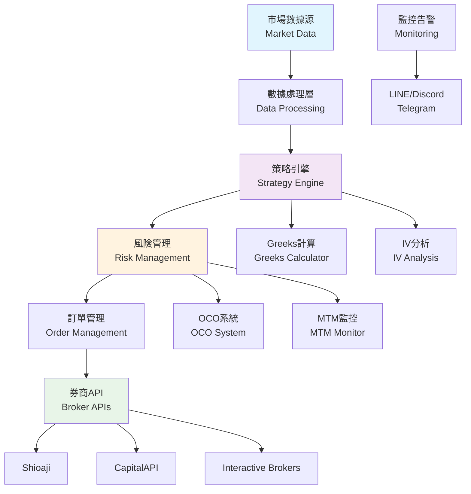
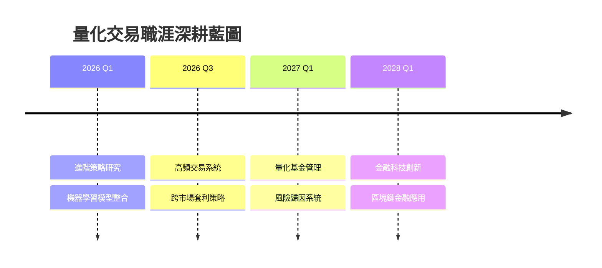

<div align="center">

# 🎯 Wei Tsen-Yu (魏岑宇)


[](https://linkedin.com/in/weitsenyu)
[](mailto:a0906583999@gmail.com)
[]()
[](https://github.com/Weitsenyu)

---

### 💫 **核心專長 | Core Expertise**

```yaml
專業領域: 
  - 量化交易系統開發
  - 選擇權策略自動化 (Short Strangle, Iron Condor)
  - 多券商API整合 (Shioaji, CapitalAPI, Interactive Brokers)
  - 風險管理與OCO訂單系統

技術成就:
  - 🏆 週報酬率 1-3%，最大回撤 ≤ 1.5%
  - 🔧 領導4人開發團隊
  - 📊 Greeks計算與ITM機率模型
  - ⚡ 即時監控與多通道告警系統
```

</div>

## 🌟 精選專案 | Featured Projects

<table>
<tr>
<td width="50%">

### 🎪 [選擇權交易儀表板](https://github.com/Weitsenyu/Option)
**Option Trading Dashboard**


**功能亮點:**
- 🔄 即時TXF/TXO行情與Bidask價差
- 📈 互動式IV Smile與OI長條圖
- 🧮 即時Greeks計算 (Δ/Γ/Θ/Ѵ/ρ)
- 🎯 策略損益模擬與獲利分布
- ⚠️ OCO觸價系統與告警
- 🔌 Shiojai API整合與WebSocket

</td>
<td width="50%">

### 🎬 [YouTube Shorts 桌面版](https://github.com/Weitsenyu/YouTube-Shorts-Desktop)
**YouTube Shorts Desktop App**


**創新特色:**
- 🖼️ 置頂懸浮視窗設計
- ⌨️ 全域快捷鍵控制
- 🎭 自動劇院模式
- 🔧 單一實例保護
- 💾 設定持久化存儲
- 🎨 流暢UI與鍵盤操作

</td>
</tr>
</table>

---

## 🛠️ 技術生態系統 | Technology Ecosystem

<div align="center">

### **程式語言與框架**


### **交易API與工具**


### **前端與視覺化**


### **DevOps與部署**


</div>

---

## 📊 交易系統架構 | Trading System Architecture



---

## 💼 專業經驗 | Professional Experience

<table>
<tr>
<td width="30%"><strong>🏢 宇宙銀河財富管理</strong></td>
<td width="40%"><strong>開發團隊主管</strong></td>
<td width="30%"><strong>2025.01 - 2025.04</strong></td>
</tr>
<tr>
<td colspan="3">
• 領導4人技術團隊，負責自動化交易平台架構設計<br/>
• 整合Shioaji、CapitalAPI、IB API，實現統一下單回報系統<br/>
• 建立Greeks與ITM機率模型，優化履約價選擇策略<br/>
• 實現週報酬1-3%，最大回撤≤1.5%的穩定績效<br/>
</td>
</tr>
</table>

<table>
<tr>
<td width="30%"><strong>🏢 宇宙銀河財富管理</strong></td>
<td width="40%"><strong>量化交易員</strong></td>
<td width="30%"><strong>2024.04 - 2024.12</strong></td>
</tr>
<tr>
<td colspan="3">
• 開發EMA、布林通道、GARCH策略，使用Python與MultiCharts<br/>
• 建立OCO訂單邏輯與動態部位管理系統<br/>
• 自動化TAIFEX tick資料收集與PyQt6交易監控GUI<br/>
• 實現Put-Call Parity監控與套利機會自動偵測<br/>
</td>
</tr>
</table>

---

## 🎯 選擇權策略專精 | Options Strategy Expertise

### 🔥 績效指標 | Performance Metrics
- **📈 週報酬率**: 1-3%
- **📉 最大回撤**: ≤ 1.5% 
- **🛡️ 風險控制**: 即時MTM監控

---

## 📚 技術專長詳解 | Technical Deep Dive

<details>
<summary><b>🐍 Python量化分析技術棧</b></summary>

```python
# 核心數據分析套件
pandas, numpy, scipy          # 數據處理與統計分析  
matplotlib, plotly            # 圖表視覺化
statsmodels                   # 統計模型

# 機器學習與建模
scikit-learn                  # 機器學習算法
tensorflow/keras              # 深度學習框架

# 交易相關
quantlib                      # 金融數學計算
ta-lib                       # 技術指標
backtrader                   # 策略回測
```

</details>

<details>
<summary><b>🔌 API整合與即時系統</b></summary>

- **Shioaji API**: 永豐金證券Python交易API
- **CapitalAPI**: 群益證券交易介面  
- **Interactive Brokers API**: 國際券商TWS整合
- **WebSocket即時串流**: tick-level市場數據
- **RESTful API設計**: 微服務架構實現

</details>

<details>
<summary><b>🎨 前端與GUI開發</b></summary>

- **PyQt6**: 專業交易員工作站介面
- **React.js + D3.js**: 互動式圖表儀表板
- **Electron**: 跨平台桌面應用程式
- **Socket.IO**: 即時數據推送
- **CSS3動畫**: 流暢使用者體驗

</details>

---

<div align="center">

## 🚀 未來發展規劃 | Career Development Roadmap

<div align="center">



**專業深耕方向:**
- **🎯 量化交易專精**: 深入研究進階選擇權策略與市場微結構
- **🤖 AI金融應用**: 機器學習在量化投資的創新應用
- **🏗️ 系統架構進化**: 大規模分散式交易系統設計
- **🌐 跨境市場**: 美股、加密貨幣等多元市場交易系統

**長期願景:**
- **📈 成為量化交易領域專家**: 在期權定價、風險管理、高頻交易等領域建立專業聲譽
- **🏢 技術團隊領導**: 領導大型量化交易平台的技術架構與團隊管理
- **💡 金融科技創新**: 推動傳統金融與新興科技的融合創新

</div>

</div>

---

## 📊 GitHub統計與活躍度 | GitHub Analytics

<div align="center">
  


</div>

<div align="center">
  


</div>

### 🏆 成就徽章 | Achievements
<div align="center">
  


</div>

---

## 💬 聯絡與合作 | Contact & Collaboration

<div align="center">

### 🤝 **歡迎討論**
**量化交易策略** • **API系統整合** • **風險管理系統** • **金融科技創新**

### 📫 **聯絡方式**
[](https://linkedin.com/in/weitsenyu)
[](mailto:a0906583999@gmail.com)
[](https://github.com/Weitsenyu)

### 🌟 **開放機會**
**遠距工作友善** • **量化交易工程師** • **風險管理專家** • **API整合顧問**

---

*"在量化交易的世界裡，程式碼就是策略，數據就是武器"*  
*"In quantitative trading, code is strategy and data is the weapon"*


</div>
