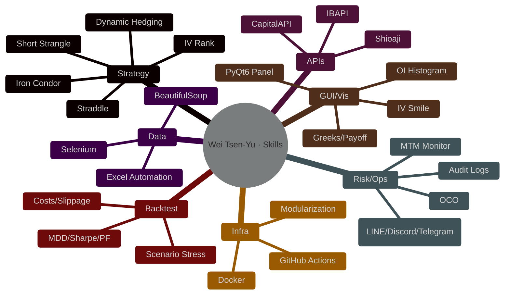
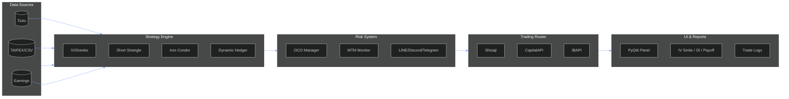
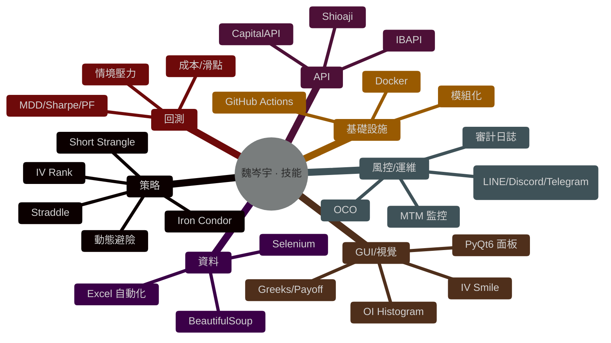
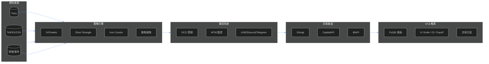

<!--
   ███████╗ ███████╗███╗   ██╗██╗   ██╗██╗   ██╗██╗   ██╗
   ██╔════╝ ██╔════╝████╗  ██║██║   ██║╚██╗ ██╔╝╚██╗ ██╔╝
   █████╗   █████╗  ██╔██╗ ██║██║   ██║ ╚████╔╝  ╚████╔╝
   ██╔══╝   ██╔══╝  ██║╚██╗██║██║   ██║  ╚██╔╝    ╚██╔╝
   ██║      ███████╗██║ ╚████║╚██████╔╝   ██║       ██║
   ╚═╝      ╚══════╝╚═╝  ╚═══╝ ╚═════╝    ╚═╝       ╚═╝

   Wei Tsen-Yu | 魏岑宇
   Quant Trading Engineer · Options Automation · Multi-Broker APIs · Risk & OCO

   README is bilingual. Quick intro first; then pick EN or 中文 from the buttons.
-->

<h1>Wei Tsen-Yu</h1>

<!-- HERO: typing svg (robust, clickable to LinkedIn) -->

<!-- Language switch buttons -->

  
  

<!-- Contact / meta badges -->

  
  
  
  
  
  

---

## Quick Intro · 快速介紹
I build **options trading systems** that connect **market data → risk → execution**, with **Greeks/IV** logic, **OCO** rules, and **PyQt6** dashboards.  
我打造覆蓋 **行情 → 風控 → 下單** 的 **選擇權系統**，以 **Greeks/IV** 為核心，搭配 **OCO** 規則與 **PyQt6** 儀表。

  
  

---

<b>English Section (click to expand)</b>

## About
I’m a **Quant Trading Engineer** focused on **options automation**, **multi-broker API integration**, and **risk engineering**. I turn research into production systems with high **observability** and **safety** across the pipeline **market data → risk → execution**.

- **Strategies**: short-vol structures (Short Strangle / Iron Condor / Straddle), IV/Greeks-driven logic, dynamic hedging  
- **APIs**: **Shioaji**, **CapitalAPI**, **IBAPI** — unified routing & normalized order/exec reports  
- **Engineering**: **PyQt6** trading panel, alerting (LINE / Discord / Telegram), Dockerized services, CI/CD on GitHub Actions  
- **Visualization**: IV Smile, OI Histogram, Greeks, payoff & PnL dashboards

## Highlights
- 🔁 **Multi-broker integration**: Shioaji / CapitalAPI / IBAPI in one coherent flow (quotes → risk → orders)  
- 🧠 **Greeks/IV driven**: adaptive strikes/widths, dynamic hedging, structured **OCO** risk rules  
- 🧰 **Tooling**: GUI (PyQt6), backtesting, monitoring/logging, Docker + CI/CD  
- 📈 **Visuals**: IV Smile, OI/Greeks distributions, payoff & drawdown views  
- 🧪 **Data**: Selenium/BS4 pipelines for TAIFEX/earnings/ticks  
- 🧩 **Modularity**: strategy engine / router / risk / reporting decoupled

## Skills Matrix
**Python** (Pandas, NumPy, SciPy, statsmodels, matplotlib, plotly) · **PyQt6** · **APIs** (Shioaji / CapitalAPI / IBAPI) · **SQL** · **Selenium/BS4** · **Docker** · **GitHub Actions** · **Node.js/Express** · **React/D3/Socket.IO**

  
  
  
  
  
  
  
  
  
  
  
  

## System Design

## Strategy Playbook
- **Short Strangle / Iron Condor**
  - Entry: IV rank threshold, ATR context, earnings/holiday filters
  - Width: delta targeting & expected move
  - Management: profit ladder, rolling & hedging triggers
- **Dynamic Hedging**: delta bands, cool-downs; underlier/futures to trim risk  
- **Greeks/IV**: skew/smile checks; **vega** sizing; **gamma** control near expiry  
- **OCO Risk**: TP/SL mutual exclusion; MTM kill-switch; order throttling

## Backtesting & Analytics
- **Costs & Slippage**, partial fills, queue effects  
- **Metrics**: Sharpe, Sortino, MDD, WinRate, PF, tail losses  
- **Scenarios**: vol expansion/contraction, gap risk, early assignment

## Featured Projects
- **Option – Automated Options Trading Platform** → **[Weitsenyu/Option](https://github.com/Weitsenyu/Option)**  
  Python, PyQt6, IV/Greeks, dynamic hedging, **OCO**, unified routing for **Shioaji/Capital/IB**
- **YouTube-Shorts-Desktop** → **[Weitsenyu/YouTube-Shorts-Desktop](https://github.com/Weitsenyu/YouTube-Shorts-Desktop)**  
  Desktop app (Electron/Node.js or PyQt6), API fetch, smooth UI

  
  

## Roadmap
- [ ] Broker redundancy & auto-failover  
- [ ] Hedging venue selection (liquidity-aware)  
- [ ] Risk service micro-components  
- [ ] Options web dashboard (React + D3)  
- [ ] Strategy config UI & scenario simulator  

## Stats & Badges

  
  
  

---

<b>中文段落（點我展開）</b>

## 關於我
我是一名 **量化交易工程師**，專注 **選擇權自動化**、**多券商 API 串接** 與 **風險工程**，將研究轉化為具 **可觀測性** 與 **安全性** 的實戰系統，完整覆蓋 **行情 → 風控 → 下單**。

- **策略**：賣方結構（Short Strangle / Iron Condor / Straddle）、IV/Greeks 驅動、動態避險  
- **API**：**Shioaji**、**CapitalAPI**、**IBAPI**（下單路由與委託回報一致化）  
- **工程**：**PyQt6** 交易面板、LINE/Discord/Telegram 告警、Docker 化服務、GitHub Actions CI/CD  
- **視覺**：IV Smile、OI Histogram、Greeks、Payoff 與 PnL 儀表

## 亮點速覽
- 🔁 **多券商打通**：Shioaji / CapitalAPI / IBAPI 同步整合（行情→風控→下單）  
- 🧠 **Greeks/IV 驅動**：自適應履約價與價差寬度、動態避險、**OCO** 規則化  
- 🧰 **完整工具**：GUI（PyQt6）、回測框架、監控告警與日誌、Docker＋CI/CD  
- 📈 **視覺化**：IV Smile、OI/Greeks 分布、Payoff、Drawdown  
- 🧪 **資料管線**：Selenium/BS4 擷取 TAIFEX／財報／Tick 餵研究與回測  
- 🧩 **模組化**：策略引擎／路由器／風控／報表 清晰分工

## 技能矩陣
**Python**（Pandas、NumPy、SciPy、statsmodels、matplotlib、plotly）· **PyQt6** · **APIs**（Shioaji／CapitalAPI／IBAPI）· **SQL** · **Selenium/BS4** · **Docker** · **GitHub Actions** · **Node.js/Express** · **React/D3/Socket.IO**

## 系統設計

## 策略手冊
- **Short Strangle / Iron Condor**
  - 進場：IV Rank、ATR/事件濾網
  - 寬度：Delta 目標與 Expected Move
  - 管理：分段停利、Rolling 與避險觸發
- **動態避險**：Delta 帶與冷卻時間；期貨/標的對沖  
- **Greeks/IV**：Smile/Skew 檢查；**Vega** 控倉；到期前 **Gamma** 風險控制  
- **OCO 風控**：TP/SL 互斥；MTM kill-switch；下單節流

## 代表專案
- **Option — 自動化選擇權交易平台** → **[Weitsenyu/Option](https://github.com/Weitsenyu/Option)**  
  Python、PyQt6、IV/Greeks、動態避險、**OCO**、**Shioaji/Capital/IB** 統一路由
- **YouTube-Shorts-Desktop** → **[Weitsenyu/YouTube-Shorts-Desktop](https://github.com/Weitsenyu/YouTube-Shorts-Desktop)**  
  桌面端（Electron/Node.js 或 PyQt6）、API 取數、流暢 UI

## 規劃
- [ ] 券商冗餘與自動故障轉移  
- [ ] 避險場域最佳化（流動性感知）  
- [ ] 風控服務微模組化  
- [ ] Web 儀表（React + D3）  
- [ ] 策略設定 UI 與情境模擬器  

## 統計與徽章

  
  
  

---

## Contact · 聯絡
- **LinkedIn**: https://www.linkedin.com/in/weitsenyu/  
- **Email**: a0906583999@gmail.com

  

