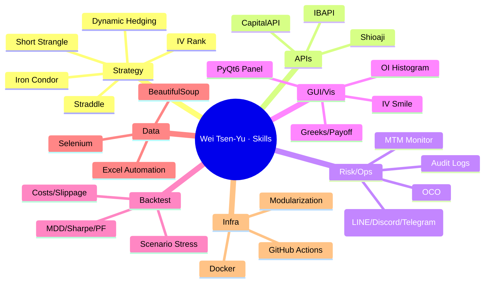
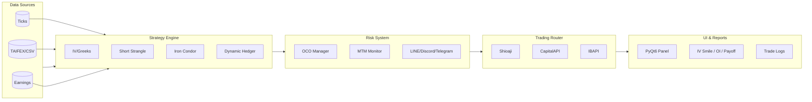
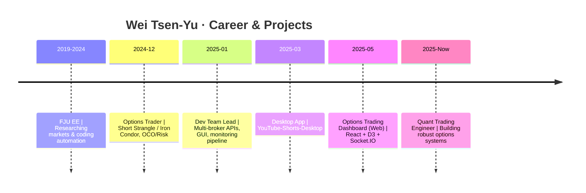

<!--
   ███████╗ ███████╗███╗   ██╗██╗   ██╗██╗   ██╗██╗   ██╗
   ██╔════╝ ██╔════╝████╗  ██║██║   ██║╚██╗ ██╔╝╚██╗ ██╔╝
   █████╗   █████╗  ██╔██╗ ██║██║   ██║ ╚████╔╝  ╚████╔╝
   ██╔══╝   ██╔══╝  ██║╚██╗██║██║   ██║  ╚██╔╝    ╚██╔╝
   ██║      ███████╗██║ ╚████║╚██████╔╝   ██║       ██║
   ╚═╝      ╚══════╝╚═╝  ╚═══╝ ╚═════╝    ╚═╝       ╚═╝

   Wei Tsen-Yu | 魏岑宇
   Quant Trading Engineer · Options Automation · Multi-Broker APIs · Risk & OCO

   本 README 採中英雙語（繁中為主）。English sections are below each part or in collapsible 
.
-->

<!-- ===== HERO ===== -->

  

  
  
  
  
  
  

---

## 🛰️ 關於我 · About Me

**我是魏岑宇（Wei Tsen-Yu）** —— 專注 **選擇權自動化交易** 與 **量化策略工程**。我把研究想法落地為穩定可觀測的交易系統：

- ✅ **策略**：Short Strangle／Iron Condor／Straddle、IV Rank、動態避險  
- ✅ **API**：**Shioaji**（永豐金）、**CapitalAPI**（凱基）、**IBAPI**（盈透）  
- ✅ **風控**：**OCO** 一觸即發、MTM 監控、例外管理與 LINE/Discord/Telegram 告警  
- ✅ **可視化**：**PyQt6** 交易面板、IV Smile／OI Histogram／Greeks、PnL/回撤儀表  
- ✅ **工程化**：模組化、容器化（Docker）、CI/CD（GitHub Actions）、可觀測性與日誌追溯

> 目標：深耕 **Quant Trading Engineer / Options System Developer**，把「研究 × 工程 × 風控」做到產品級。

English (click to expand)

I'm <b>Wei Tsen-Yu</b>, focused on <b>options automation</b> and <b>quant strategy engineering</b>. 
• <b>Strategies</b>: Short Strangle / Iron Condor / Straddle, IV Rank, dynamic hedging 
• <b>APIs</b>: <b>Shioaji</b>, <b>CapitalAPI</b>, <b>IBAPI</b> 
• <b>Risk</b>: <b>OCO</b> (one-cancels-other), MTM monitoring, alerting via LINE/Discord/Telegram 
• <b>Visualization</b>: <b>PyQt6</b> trading panel, IV Smile / OI Histogram / Greeks, PnL/MDD dashboards 
• <b>Engineering</b>: modular architecture, Docker, CI/CD, observability & audit logs

---

## 🧭 目錄 · Table of Contents
- [關於我 · About Me](#-關於我--about-me)
- [亮點速覽 · Highlights](#-亮點速覽--highlights)
- [技能矩陣 · Skills Matrix](#-技能矩陣--skills-matrix)
- [代表專案 · Featured Projects](#-代表專案--featured-projects)
- [績效與風控觀念 · Performance & Risk](#-績效與風控觀念--performance--risk)
- [研究與工程 · Research & Engineering](#-研究與工程--research--engineering)
- [時間線 · Career Timeline](#-時間線--career-timeline)
- [統計與徽章 · Stats & Badges](#-統計與徽章--stats--badges)
- [聯絡我 · Contact](#-聯絡我--contact)
- [附錄 · Appendix（研究清單／FAQ）](#-附錄--appendix研究清單faq)

---

## 🚀 亮點速覽 · Highlights

- 🔁 <b>多券商 API 打通</b>：Shioaji／CapitalAPI／IBAPI <b>同時串接</b>，行情→風控→下單 <b>一條龍自動化</b>  
- 🧠 <b>Greeks/IV 驅動策略</b>：賣方結構（Short Strangle / Iron Condor）＋<b>動態避險與倉位分層</b>  
- 🧰 <b>完整工具鏈</b>：PyQt6 GUI、回測框架、監控告警、交易日誌、Docker＋CI/CD  
- 📈 <b>視覺化</b>：IV Smile、OI Histogram、Payoff、Greeks 全套圖表  
- 🧪 <b>資料采集</b>：Selenium／BeautifulSoup 擷取 TAIFEX／財報／Tick 餵回測  
- 🧩 <b>鬆耦合架構</b>：策略引擎、路由器、風控器、報表服務 <b>清晰分層</b>

English (click to expand)

• <b>Multi-broker integration</b> (Shioaji / CapitalAPI / IBAPI) across market→risk→execution 
• <b>Greeks & IV-driven</b> short options with <b>dynamic hedging & layered risk</b> 
• <b>End-to-end toolchain</b>: PyQt6 GUI, backtesting, monitoring, logging, Docker, CI/CD 
• <b>Full visualization</b>: IV Smile, OI Histogram, Payoff, Greeks 
• <b>Data pipelines</b>: Selenium/BS4 for TAIFEX, earnings, ticks 
• <b>Modularity</b>: strategy engine, router, risk, reporting

---

## 🛠️ 技能矩陣 · Skills Matrix

### Core Stack
**Python**（Pandas／NumPy／SciPy／statsmodels／matplotlib／plotly）  
**PyQt6**（跨平台交易 GUI 與監控面板）  
**APIs**：Shioaji／CapitalAPI／IBAPI  
**Data**：Selenium／BeautifulSoup／Excel 自動化  
**DB/Infra**：SQL（SQLite／PostgreSQL）、Docker、GitHub Actions  
**Web**：Node.js／Express、React、D3.js、Socket.IO（市況推播）

  
  
  
  
  
  
  
  
  
  
  
  
  
  
  
  
  

### 技能心智圖（Mermaid Mindmap）

---

## 🌟 代表專案 · Featured Projects

### 1) Option — 自動化選擇權交易平台
**Repo**：[`Weitsenyu/Option`](https://github.com/Weitsenyu/Option)

- **功能**：多券商 API（Shioaji／Capital／IB）行情→下單→回報一致化、<b>OCO</b>、動態避險、Greeks/IV 模組、交易日誌、風控儀表板  
- **GUI**：<b>PyQt6</b> 操作面板（Long／Short／Neutral／Micro Long／Micro Short）、條件單管理、異常告警  
- **視覺**：IV Smile、OI Histogram、Payoff、PnL 分佈  
- **工程**：模組化策略引擎、路由器、風控器、報表服務；Docker & CI/CD

架構圖（Mermaid）

  

---

### 2) YouTube-Shorts-Desktop — 桌面端 Shorts 管理
**Repo**：[`Weitsenyu/YouTube-Shorts-Desktop`](https://github.com/Weitsenyu/YouTube-Shorts-Desktop)

- **技術**：Electron + Node.js（或 PyQt6 版本）、全局快捷鍵、單例、設定與持久化  
- **功能**：桌面觀看／管理 Shorts、API 取數、流暢 UI 互動

  

---

## 🛡️ 績效與風控觀念 · Performance & Risk

> <b>原則重於數字</b>：市場會變，系統要抗壓。  
> 以 <b>回撤控制（MDD）</b>、<b>動態避險</b>、<b>OCO 風控</b>、<b>監控告警</b> 為核心。

- <b>系統面</b>  
  - <b>Greeks / IV 驅動</b> 的賣方策略（Short Strangle / Iron Condor）  
  - <b>OCO 觸發互斥</b>、延時／錯單防護、分層控倉  
  - <b>MTM 監控</b>＋<b>LINE/Discord/Telegram</b> 告警  
  - <b>交易日誌</b>：委託／成交／撤單／異常可追溯  

- <b>回測面</b>  
  - 嚴格納入 <b>交易成本／滑點／停權日／極端事件</b>  
  - 核心指標 <b>Sharpe、MDD、WinRate、PF、PnL 分佈</b>  
  - <b>情境壓力測試</b>：波動擴張／收斂、Gap Risk、提前指派

English summary

<b>System</b>: Greeks/IV-driven short options with <b>OCO</b> risk control, MTM monitoring, alerts, and auditable logs. 
<b>Backtest</b>: Costs, slippage, halt days, outlier events; Sharpe, MDD, WinRate, PF, distributional PnL; scenario stress.

---

## 🔬 研究與工程 · Research & Engineering

- <b>定價與風險</b>：Black–Scholes、Monte Carlo、ARCH/GARCH、Put-Call Parity 偏離監控  
- <b>資料處理</b>：日內 Tick／Bid-Ask 聚合、波動微結構、TAIFEX／上市櫃資料清洗  
- <b>自動化</b>：Selenium／BS4 排程抓取、Excel 自動匯出、週期風險報表  
- <b>產品化</b>：Docker 容器化、GitHub Actions CI/CD、自動測試與部署

---

## 🕰️ 時間線 · Career Timeline

---

## 📊 統計與徽章 · Stats & Badges

  
  

  

<!-- 若日後想加「蛇形貢獻圖」，需建立 GitHub Action（可參考 Platane/snk）後再啟用下列影像：

  

-->

---

## 🤝 正在尋找 · Open to Work

- <b>Quant Trading Engineer</b>（量化交易工程師）  
- <b>Options System Developer</b>（選擇權系統開發）

> 合作或機會邀約，歡迎透過 <b>LinkedIn</b> 或 <b>Email</b> 聯繫 🙌

---

## 🔗 速連 · Quick Links

- 🧰 Option（自動化選擇權交易平台）：<https://github.com/Weitsenyu/Option>  
- 💻 YouTube-Shorts-Desktop：<https://github.com/Weitsenyu/YouTube-Shorts-Desktop>  
- 💼 LinkedIn：<https://www.linkedin.com/in/weitsenyu/>  
- ✉️ Email：<b>a0906583999@gmail.com</b>

---

## 📎 附錄 · Appendix（研究清單／FAQ）

### ① 研究主題（持續擴充）
- IV 曲面／Skew／Smile 對賣方倉位的風險傳導  
- 事件風險（財報／宏觀）對隱波與定價的影響  
- 微結構：Bid-Ask 擴張與成交不對稱對日內 PnL 的影響  
- 動態避險觸發條件、對沖成本與效率  
- Put-Call Parity 偏離偵測與套利窗口

### ② 回測設計（要點）
- 區間：交易日交集、結算日處理、到期週期  
- 指標：累積／年化報酬、Sharpe、MDD、PF、WinRate  
- 分佈：日內 PnL、尾部風險、Gap Risk 情境  
- 成本：交易費／滑點／借券成本（如適用）

### ③ FAQ
**Q1：為什麼偏好賣方策略？**  
A：波動溢價（vol premia）與 theta 衰減可被系統化捕捉；搭配 <b>IV/Greeks</b> 與 <b>OCO</b> 風控，極端情況更可控與可解釋。

**Q2：如何降低「黑天鵝」風險？**  
A：分層控倉、事件暫停／降槓桿、動態避險、跨券商路由冗餘、風控閾值多層觸發（含撤退機制）。

**Q3：研究 vs 工程？**  
A：我做兩者橋接。<b>研究要能落地</b>；工程要可維護、可觀測、可擴展 —— 這是我最重視的能力結構。

---

  

