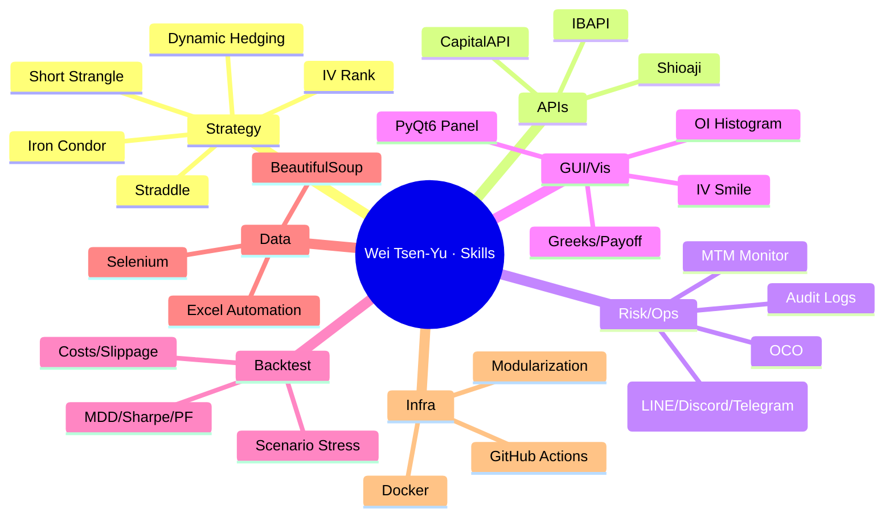
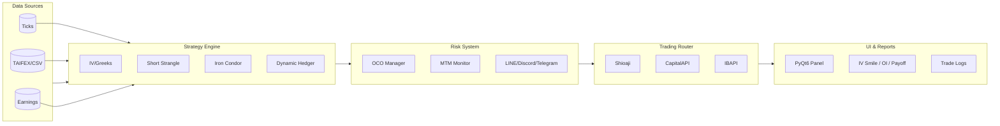
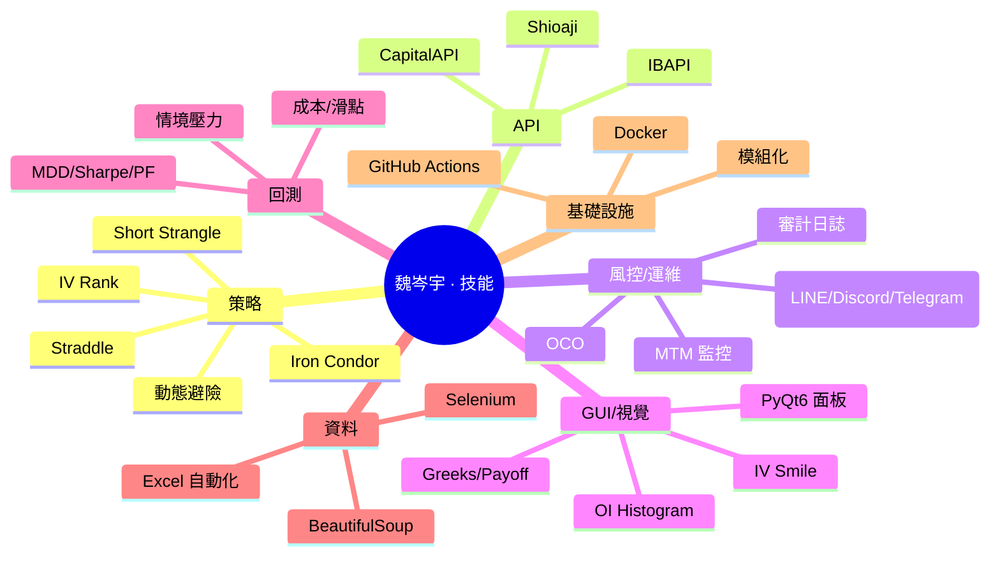
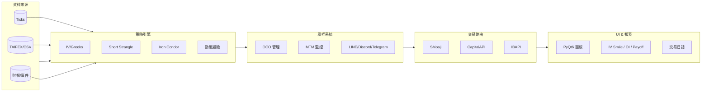

<!--
   ███████╗ ███████╗███╗   ██╗██╗   ██╗██╗   ██╗██╗   ██╗
   ██╔════╝ ██╔════╝████╗  ██║██║   ██║╚██╗ ██╔╝╚██╗ ██╔╝
   █████╗   █████╗  ██╔██╗ ██║██║   ██║ ╚████╔╝  ╚████╔╝
   ██╔══╝   ██╔══╝  ██║╚██╗██║██║   ██║  ╚██╔╝    ╚██╔╝
   ██║      ███████╗██║ ╚████║╚██████╔╝   ██║       ██║
   ╚═╝      ╚══════╝╚═╝  ╚═══╝ ╚═════╝    ╚═╝       ╚═╝

   Wei Tsen-Yu | 魏岑宇
   Quant Trading Engineer · Options Automation · Multi-Broker APIs · Risk & OCO

   English first. 中文在下方，點最上面的連結可快速跳轉。
-->

# Wei Tsen‑Yu

**English · [中文在這裡 → Jump to Chinese](#zh)**

---

## Table of Contents
- [About](#about)
- [Highlights](#highlights)
- [Skills Matrix](#skills-matrix)
- [System Design](#system-design)
- [Strategy Playbook](#strategy-playbook)
- [Risk & Operations](#risk--operations)
- [Backtesting & Analytics](#backtesting--analytics)
- [Featured Projects](#featured-projects)
- [Roadmap](#roadmap)
- [Stats & Badges](#stats--badges)
- [Contact](#contact)
- [中文版本 · Chinese Version](#zh)

---

## About
I’m a **Quant Trading Engineer** focused on **options automation**, **multi-broker API integration**, and **risk engineering**. I turn research into production systems with strong **observability** and **safety** across the pipeline **market data → risk → execution**.

- **Strategies**: short-vol structures (Short Strangle / Iron Condor / Straddle), IV/Greeks‑driven logic, dynamic hedging  
- **APIs**: **Shioaji**, **CapitalAPI**, **IBAPI** — unified routing & normalized order/exec reports  
- **Engineering**: **PyQt6** trading panel, alerting (LINE / Discord / Telegram), Dockerized services, CI/CD on GitHub Actions  
- **Visualization**: IV Smile, OI Histogram, Greeks, payoff & PnL dashboards

> **Goal:** Keep deepening in options systems engineering — combine **research × engineering × risk** to ship robust, explainable automation.

---

## Highlights
- 🔁 **Multi‑broker integration**: Shioaji / CapitalAPI / IBAPI in one coherent flow (quotes → risk → orders)  
- 🧠 **Greeks/IV driven**: dynamic strikes/widths, adaptive hedging, structured OCO risk rules  
- 🧰 **Tooling end‑to‑end**: GUI (PyQt6), backtest framework, monitoring & logs, Docker + CI/CD  
- 📈 **Rich visuals**: IV Smile, OI/Greeks distributions, payoff & drawdown views  
- 🧪 **Data pipelines**: Selenium/BS4 for TAIFEX/earnings/ticks feeding research & tests  
- 🧩 **Modularity**: strategy engine / router / risk / reporting decoupled with clear interfaces

---

## Skills Matrix
**Python** (Pandas, NumPy, SciPy, statsmodels, matplotlib, plotly) · **PyQt6** · **APIs** (Shioaji / CapitalAPI / IBAPI) · **SQL** · **Selenium/BS4** · **Docker** · **GitHub Actions** · **Node.js/Express** · **React/D3/Socket.IO**

  
  
  
  
  
  
  
  
  
  
  
  

---

## System Design

**Notes**
- **Unified schema** for quotes/orders/executions across brokers
- **Retries & timeouts** on order routes; **idempotent** commands
- **Audit logs** for all events; **alerting** on latencies, slippage, risk trips

---

## Strategy Playbook
- **Short Strangle / Iron Condor**
  - Entry: IV rank threshold, underlying ATR context, earnings/holiday filters
  - Width selection: delta targeting & expected move
  - Management: profit‑taking ladder, rolling & hedging triggers
- **Dynamic Hedging**
  - Delta thresholds with cool‑down windows
  - Use futures or underlying to trim directional risk
- **Greeks / IV**
  - Smile/skew checks before entry; **vega** exposure sizing
  - **Gamma risk** around expiry; reduce width or shut down near‑ITM
- **OCO Risk**
  - TP vs. SL mutual exclusion; **kill‑switch** on MTM breach
  - Throttle orders; duplicate prevention

---

## Risk & Operations
- **MTM dashboards** and **PnL bands** for day, week, month
- **Alerts**: LINE / Discord / Telegram with rate‑limit & dedup
- **Runbooks**: network/broker outage procedures; fallback routes
- **Post‑trade**: reconcile fills, generate EOD reports (CSV/HTML/PDF)

---

## Backtesting & Analytics
- **Costs & Slippage**: realistic commissions, partial fills, queue effects
- **Metrics**: Sharpe, Sortino, MDD, WinRate, PF, hit ratio, tail losses
- **Scenario tests**: vol expansion/contraction, gap risk, early assignment
- **Distributions**: intraday PnL, drawdown recovery, trade duration

| Metric | Meaning |
|---|---|
| **Sharpe** | Excess return / stdev |
| **MDD** | Max peak‑to‑trough drawdown |
| **PF** | Gross profit / gross loss |
| **WinRate** | Winning trades / total |

---

## Featured Projects

### 1) Option — Automated Options Trading Platform
**Repo**: **[Weitsenyu/Option](https://github.com/Weitsenyu/Option)**

- **APIs**: Shioaji / Capital / IB unified routing, consistent exec reports  
- **Risk**: **OCO**, MTM bands, alerts, kill‑switch  
- **GUI**: **PyQt6** panel (Long/Short/Neutral/Micro modes), conditional orders, exceptions view  
- **Visuals**: IV Smile, OI Histogram, Payoff, PnL distribution  
- **Engineering**: modular strategy engine, router, risk, reports; Docker & CI/CD

  

### 2) YouTube‑Shorts‑Desktop — Desktop Shorts Manager
**Repo**: **[Weitsenyu/YouTube‑Shorts‑Desktop](https://github.com/Weitsenyu/YouTube-Shorts-Desktop)**

- **Tech**: Electron + Node.js (or PyQt6 build), singleton + global hotkeys  
- **Features**: desktop viewing/management, API fetch, smooth UI

  

---

## Roadmap
- [ ] Broker redundancy & auto‑failover
- [ ] Hedging venue selection (liquidity‑aware)
- [ ] Risk service refactor into micro‑components
- [ ] Options web dashboard (React + D3)
- [ ] Strategy config UI & scenario simulator

---

## Stats & Badges

  
  

  

<!-- If you want the contribution snake later, enable a GitHub Action (Platane/snk) and then use the image below.

  

-->

---

## Contact
- **LinkedIn**: https://www.linkedin.com/in/weitsenyu/  
- **Email**: a0906583999@gmail.com

---

# 中文版本 · Chinese Version

**[Back to English](#en)**

## 關於我
我是一名 **量化交易工程師**，專注 **選擇權自動化**、**多券商 API 串接** 與 **風險工程**，將研究轉化為具 **可觀測性** 與 **安全性** 的實戰系統，完整覆蓋 **行情 → 風控 → 下單** 流程。

- **策略**：賣方結構（Short Strangle / Iron Condor / Straddle）、IV/Greeks 驅動、動態避險  
- **API**：**Shioaji**、**CapitalAPI**、**IBAPI**（下單路由與委託回報一致化）  
- **工程**：**PyQt6** 交易面板、LINE/Discord/Telegram 告警、Docker 化服務、GitHub Actions CI/CD  
- **視覺**：IV Smile、OI Histogram、Greeks、Payoff 與 PnL 儀表板

> **目標：**持續深耕 **選擇權系統工程**，以 **研究 × 工程 × 風控** 打造穩健、可解釋的自動化交易。

---

## 亮點速覽
- 🔁 **多券商打通**：Shioaji / CapitalAPI / IBAPI 同步整合（行情→風控→下單）  
- 🧠 **Greeks/IV 驅動**：自適應履約價與價差寬度、動態避險、OCO 規則化  
- 🧰 **完整工具鏈**：GUI（PyQt6）、回測框架、監控告警與日誌、Docker＋CI/CD  
- 📈 **視覺化**：IV Smile、OI/Greeks 分布、Payoff、Drawdown  
- 🧪 **資料管線**：Selenium/BS4 擷取 TAIFEX／財報／Tick 餵研究與回測  
- 🧩 **模組化**：策略引擎／路由器／風控／報表清晰分工

---

## 技能矩陣
**Python**（Pandas、NumPy、SciPy、statsmodels、matplotlib、plotly）· **PyQt6** · **APIs**（Shioaji／CapitalAPI／IBAPI）· **SQL** · **Selenium/BS4** · **Docker** · **GitHub Actions** · **Node.js/Express** · **React/D3/Socket.IO**

  
  
  
  
  
  
  
  
  
  
  
  

---

## 系統設計

**重點**
- **資料/委託格式統一**，跨券商一致化
- **路由重試與超時**；命令具 **冪等性**
- **審計日誌** 全事件；**延遲/滑點/風險** 告警

---

## 策略手冊
- **Short Strangle / Iron Condor**
  - 進場：IV Rank 門檻、ATR/事件濾網
  - 寬度：Delta 目標與 Expected Move
  - 管理：分段停利、Rolling 與避險觸發
- **動態避險**
  - Delta 阈值與冷卻時間
  - 以期貨/標的對沖方向性風險
- **Greeks / IV**
  - 進場前 Smile/Skew 檢查；**Vega** 控倉
  - 到期前 **Gamma** 風險收斂或關閉
- **OCO 風控**
  - TP/SL 互斥；**Kill‑switch** 於 MTM 失衡
  - 節流下單；重複防護

---

## 回測與分析
- **成本/滑點**：含部分成交、佇列效應
- **指標**：Sharpe、Sortino、MDD、WinRate、PF、損益尾部
- **情境**：波動擴張/收斂、Gap Risk、提前指派
- **分佈**：日內 PnL、回撤修復、持倉天數

| 指標 | 說明 |
|---|---|
| **Sharpe** | 超額報酬 / 標準差 |
| **MDD** | 峰谷回撤 |
| **PF** | 總利潤 / 總虧損 |
| **WinRate** | 勝場比例 |

---

## 代表專案

### 1) Option — 自動化選擇權交易平台
**倉庫**：**[Weitsenyu/Option](https://github.com/Weitsenyu/Option)**

- **API**：Shioaji / Capital / IB 統一路由、回報一致化  
- **風控**：**OCO**、MTM 區間、告警、緊急 **kill‑switch**  
- **GUI**：**PyQt6** 面板（Long/Short/Neutral/Micro 模式）、條件單管理、例外處理  
- **視覺**：IV Smile、OI Histogram、Payoff、PnL 分佈  
- **工程**：模組化策略引擎、路由、風控、報表；Docker & CI/CD

  

### 2) YouTube‑Shorts‑Desktop — 桌面端 Shorts 管理
**倉庫**：**[Weitsenyu/YouTube‑Shorts‑Desktop](https://github.com/Weitsenyu/YouTube-Shorts-Desktop)**

- **技術**：Electron + Node.js（或 PyQt6 版本）、單例、全局快捷鍵  
- **功能**：桌面觀看/管理、API 取數、流暢 UI

  

---

## 規劃
- [ ] 券商冗餘與自動故障轉移
- [ ] 避險場域最佳化（流動性感知）
- [ ] 風控服務微模組化
- [ ] Web 儀表（React + D3）
- [ ] 策略設定 UI 與情境模擬器

---

## 統計與徽章

  
  

  

---

## 聯絡
- **LinkedIn**：https://www.linkedin.com/in/weitsenyu/  
- **Email**：a0906583999@gmail.com

**Back to top · [English](#en) · [中文](#zh)**

